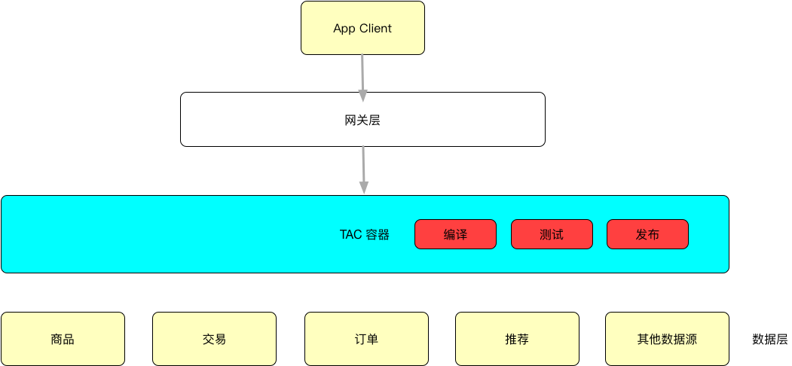
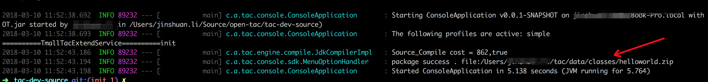
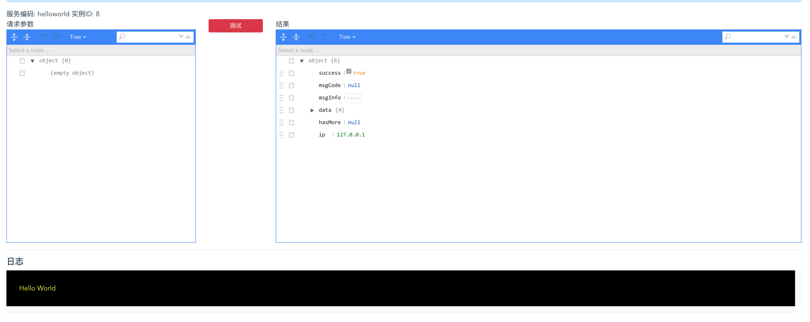

- [TAC](#tac)
  - [What is TAC ？](#what-is-tac-%EF%BC%9F)
  - [Features](#features)
  - [Why TAC？](#why-tac%EF%BC%9F)
    - [TAC 之前](#tac-%E4%B9%8B%E5%89%8D)
    - [TAC 之后](#tac-%E4%B9%8B%E5%90%8E)
  - [Quick Start](#quick-start)
    - [安装redis](#%E5%AE%89%E8%A3%85redis)
    - [运行 container](#%E8%BF%90%E8%A1%8C-container)
    - [运行 console 控制台](#%E8%BF%90%E8%A1%8C-console-%E6%8E%A7%E5%88%B6%E5%8F%B0)
    - [代码开发](#%E4%BB%A3%E7%A0%81%E5%BC%80%E5%8F%91)
    - [本地编译、打包](#%E6%9C%AC%E5%9C%B0%E7%BC%96%E8%AF%91%E3%80%81%E6%89%93%E5%8C%85)
    - [预发布](#%E9%A2%84%E5%8F%91%E5%B8%83)
    - [正式发布](#%E6%AD%A3%E5%BC%8F%E5%8F%91%E5%B8%83)
  - [启动配置参数](#%E5%90%AF%E5%8A%A8%E9%85%8D%E7%BD%AE%E5%8F%82%E6%95%B0)
  - [接入你自己的数据源](#%E6%8E%A5%E5%85%A5%E4%BD%A0%E8%87%AA%E5%B7%B1%E7%9A%84%E6%95%B0%E6%8D%AE%E6%BA%90)

# TAC

## What is TAC ？

* TAC (Tiny API Cloud ) 是与 tangram 配套的服务端解决方案。当然也支持脱离 tangram 使用；
* TAC 不是平台，也不是框架，而是一种开发模式；

## Features

* 快速发布；
* 无需部署；
* 灵活修改；
* 快速添加数据源；
* 客户端开发人员直接参与服务端逻辑；

## Why TAC？

### TAC 之前

* 在 TAC 诞生之前，天猫 app 大多数页面服务端的开发模式是这样的 。以首页为例：
  * 1.客户端与服务端同学约定接口数据类型，字段；
  * 2.服务端提供 mock 接口，两端并行开发；
  * 3.测试、部署、发布。
* 这种模式的弊端在于，由于页面依赖了各种数据源，发布是一个漫长的过程，如果遇到字段修改，整个应用重新编译、打包部署流程太长；不同的页面部署在不同的应用中，无法共享数据源

### TAC 之后

* TAC 接入各个常用数据源；
* 客户端同学直接在 TAC 上提交源码，编译、测试、并发布生效；
* 客户端页面开发不需要服务端同学参与，免去沟通过程；
* 服务端同学专注开发业务逻辑；



## Quick Start

### 安装[redis](https://redis.io/)

### 运行 container

```
java -jar tac-container.jar
```

### 运行 console 控制台

```
java -jar tac-console.jar --admin
```

* 成功后可打开控制台

```
http://localhost:7001/#/tacMs/list
```

### 代码开发

* 仓库地址 [oss.sonatype.org](https://oss.sonatype.org/#nexus-search;quick~tac-sdk)
* 添加 SDK 依赖

```
        <dependency>
            <groupId>com.alibaba</groupId>
            <artifactId>tac-sdk</artifactId>
            <version>${project.version}</version>
        </dependency>
```

* 编写代码

```java
public class HelloWorldTac implements TacHandler<Object> {

    /**
     * 引入日志服务
     */
    private TacLogger tacLogger = TacInfrasFactory.getLogger();

    /**
     * 编写一个实现TacHandler接口的类
     *
     * @param context
     * @return
     * @throws Exception
     */

    @Override
    public TacResult<Object> execute(Context context) throws Exception {

        // 执行逻辑
        tacLogger.info("Hello World");

        Map<String, Object> data = new HashMap<>();
        data.put("name", "hellotac");
        data.put("platform", "iPhone");
        data.put("clientVersion", "7.0.2");
        data.put("userName", "tac-userName");
        return TacResult.newResult(data);
    }
}
```

### 本地编译、打包

```bash
cd tac-dev-source
java -jar tac-console.jar --package --msCode=helloworld
```



### 预发布

* 预发布

* 测试预发布



### 正式发布

* 线上验证

```
curl  http://localhost:8001/api/tac/execute/helloworld -s|json
```

* 结果

```json
{
  "success": true,
  "msgCode": null,
  "msgInfo": null,
  "data": {
    "helloworld": {
      "data": {
        "name": "hellotac",
        "clientVersion": "7.0.2",
        "userName": "tac-userName",
        "platform": "iPhone"
      },
      "success": true,
      "msCode": "helloworld"
    }
  },
  "hasMore": null,
  "ip": "127.0.0.1"
}
```

## [启动配置参数](/docs/configs.md)

## [接入你自己的数据源](/docs/custom_data_source.md)

## [与gitlab集成](/docs/gitlab.md)

## [IDE源码启动——quickstart](/docs/ide_source_start.md)
