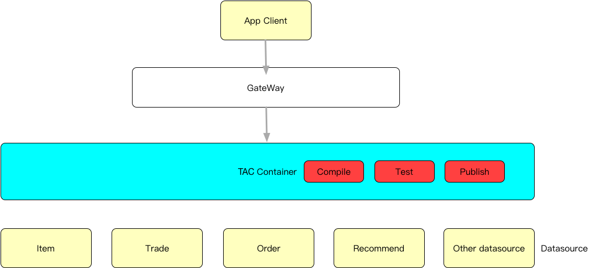

* [TAC](#tac)
  * [What is TAC ？](#what-is-tac-%EF%BC%9F)
  * [Features](#features)
  * [Why TAC？](#why-tac%EF%BC%9F)
    * [Before TAC](#before-tac)
    * [After TAC](#after-tac)
  * [Quick Start](#quick-start)
    * [Install redis](#install-redis)
    * [Run container](#run-container)
    * [Run console](#run-console)
    * [Code Develop](#code-develop)
    * [compile and package](#compile-and-package)
    * [Pre-Publish](#pre-publish)
    * [Online-Publish](#online-publish)
  * [The start params config](#the-start-params-config)
  * [Add your own datasource](#add-your-own-datasource)
  
# [中文文档](README-ch.md)

# TAC

## What is TAC ？

+ The TAC (Tiny API Cloud) is a server-side solution with tangram. Of course, it also supports the use of secession from tangram; TAC is not a platform, nor a framework, but a development model.

## Features

* Quick publish;
* Without deploy;
* Flexible modification
* Quickly add data sources
* Client developers directly participate in server-side logic;

## Why TAC？

### Before TAC

* Before the birth of TAC, the development mode of most app server-side on Tmall app was like this. Take the home page as an example:
  * Client and server developer discuss the interface data types, fields;
  * The server developer provides a mock interface with parallel development at both ends.
  * Test, deploy, release.

- The disadvantage of this model is that since the page relies on various data sources, publishing is a long process. If the field is modified, the entire application will be recompiled and packaged. The deployment process is too long; different pages are deployed in different applications. unable to share data source

### After TAC

* TAC access to various commonly used data sources;
* Clients submit source code directly on TAC, compile, test, and publish;
* Client development does not require the participation of server-side developer, eliminating the need for communication.
* Server-side developer focus on developing business logic;



## Quick Start

### Install [redis](https://redis.io/)

### Run container

```
java -jar tac-container.jar
```

### Run console

```
java -jar tac-console.jar --admin
```

* 成功后可打开控制台

```
http://localhost:7001/#/tacMs/list
```

### Code Develop

* Repo Address [oss.sonatype.org](https://oss.sonatype.org/#nexus-search;quick~tac-sdk)
* Add SDK Dependency

```
        <dependency>
            <groupId>com.alibaba</groupId>
            <artifactId>tac-sdk</artifactId>
            <version>${project.version}</version>
        </dependency>
```

* Write your code

```java
public class HelloWorldTac implements TacHandler<Object> {

    /**
     * 引入日志服务
     */
    private TacLogger tacLogger = TacInfrasFactory.getLogger();

    /**
     * 编写一个实现TacHandler接口的类
     *
     * @param context
     * @return
     * @throws Exception
     */

    @Override
    public TacResult<Object> execute(Context context) throws Exception {

        // 执行逻辑
        tacLogger.info("Hello World");

        Map<String, Object> data = new HashMap<>();
        data.put("name", "hellotac");
        data.put("platform", "iPhone");
        data.put("clientVersion", "7.0.2");
        data.put("userName", "tac-userName");
        return TacResult.newResult(data);
    }
}
```

### compile and package

```bash
cd tac-dev-source
java -jar tac-console.jar --package --msCode=helloworld
```


### Pre-Publish

* Pre-Publish

* Test-Pre-Publish


### Online-Publish

* online check

```
curl  http://localhost:8001/api/tac/execute/helloworld -s|json
```

* Result

```json
{
  "success": true,
  "msgCode": null,
  "msgInfo": null,
  "data": {
    "helloworld": {
      "data": {
        "name": "hellotac",
        "clientVersion": "7.0.2",
        "userName": "tac-userName",
        "platform": "iPhone"
      },
      "success": true,
      "msCode": "helloworld"
    }
  },
  "hasMore": null,
  "ip": "127.0.0.1"
}
```

## [The start params config](/docs/configs.md)

## [Add your own datasource](/docs/custom_data_source.md)

## [Use with gitlab](/docs/gitlab.md)