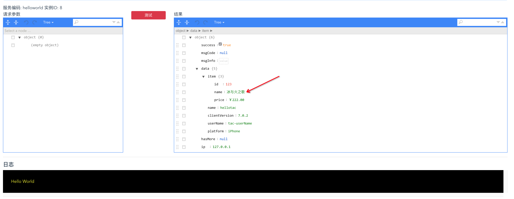

# 接入你自己的数据源

* TAC 重写了应用启动时的 classloader，允许加载外部的 class 到 spring 上下文中，基于此可实现增加自定义的数据源；

## 像往常一样编写 springBean

* 添加依赖

```xml
        <dependency>
            <groupId>com.alibaba</groupId>
            <artifactId>tac-sdk</artifactId>
            <version>${project.version}</version>
        </dependency>
```

* 我们以接入天猫商品服务为例，编写一个常规的 service (参考源码中的 tac-custom-datasource)

```java
package com.tmall.itemcenter;

import org.springframework.stereotype.Service;

/**
 * @author jinshuan.li 10/03/2018 15:43
 */
@Service
public class TmallItemService {

    /**
     * 获取商品
     *
     * @param id
     * @return
     */
    public ItemDO getItem(Long id) {

        // 此处mock
        return new ItemDO(id, "冰与火之歌", "￥222.00");
    }

}
```

## 打包

* 打成 jar 包，并将其放入 extendlibs 文件夹中
* 修改 scan.package.name 配置，增加包扫描

```properties
scan.package.name=com.tmall.itemcenter
```

## 使用

* TAC 代码中引用

```java
public class HelloWorldTac implements TacHandler<Object> {

    /**
     * 引入日志服务
     */
    private TacLogger tacLogger = TacInfrasFactory.getLogger();

    private TmallItemService tmallItemService = TacInfrasFactory.getServiceBean(TmallItemService.class);

    /**
     * 编写一个实现TacHandler接口的类
     *
     * @param context
     * @return
     * @throws Exception
     */

    @Override
    public TacResult<Object> execute(Context context) throws Exception {

        // 执行逻辑
        tacLogger.info("Hello World");

        Map<String, Object> data = new HashMap<>();
        data.put("name", "hellotac");
        data.put("platform", "iPhone");
        data.put("clientVersion", "7.0.2");
        data.put("userName", "tac-userName");

        ItemDO item = tmallItemService.getItem(123L);

        data.put("item", item);
        return TacResult.newResult(data);
    }
}
```

* 编译 运行命编译该代码，注意新增的 jar 包要在 extendlibs 中；

* 运行 在 web 控制台提交预发布，并测试



## 其他

* 在自定义数据  源中，可是用 dubbo、springcloud、hsf 等 RPC 框架，也可直接是用 http 请求；
