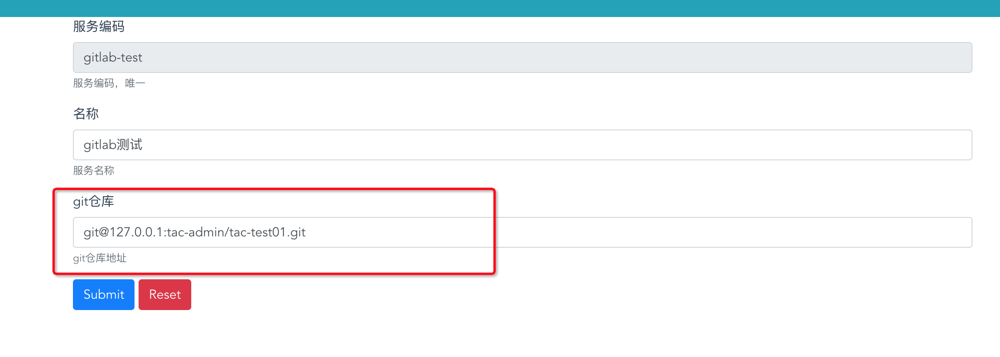
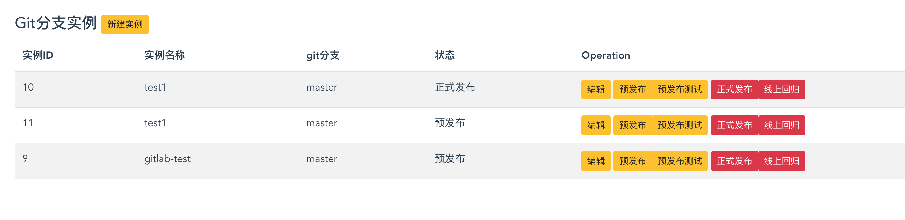

# 与 gitlab 集成

* 用户可以将 gitlab 与 tac 集成，方便管理微服务；

## Step 1 新建帐号

* tac 使用专门的 gitlab 帐号来管理相关代码；联系对应的 gitlab 服务器管理员，新建名如 tac-admin 的用户，并获取其 api token、userName、password.

## Step 2 tac 启动参数配置

* 在 tac 启动时配置如下参数

```properties
# gitlab服务器地址
tac.gitlab.config.hostURL=http://127.0.0.1

# gitlab帐号token
tac.gitlab.config.token=xxxxx

# gitlab仓库groupName
tac.gitlab.config.groupName=tac-admin


# gitlab仓库帐号名
tac.gitlab.config.userName=tac-admin

# gitlab仓库帐号密码
tac.gitlab.config.password=tac-admin


# gitlab代码下载存储路径 （各微服务代码会下载到这个路径下）
tac.gitlab.config.basePath=/home/admin/tac/git_codes
```

## Step 3 修改微服务的代码仓库地址

* 如下图所示，修改该微服务的仓库地址



## Step 4 置顶实例分支并发布


